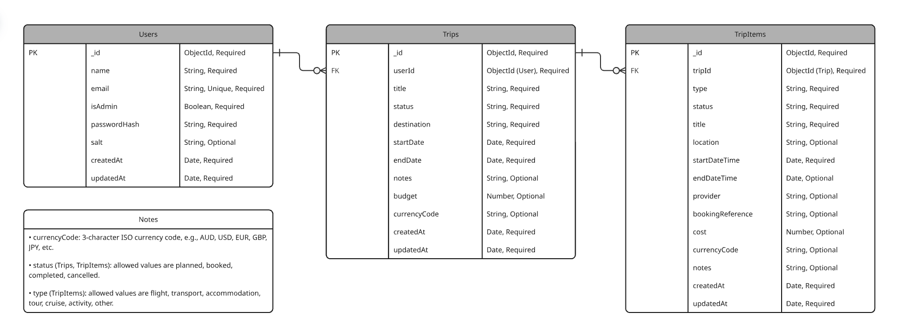

# Voyager Backend API

Voyager is a travel planning backend API built with Node.js, Express, MongoDB, Mongoose, and JWT authentication.

The backend allows users to register, log in, create trips, manage trip itinerary items, and export a trip itinerary as a PDF. Regular users can only access their own data, while admin users have separate admin-only routes for viewing and deleting data across users for support or moderation purposes.

## Project Purpose

Voyager was designed as the backend for a MERN travel planning application.

The API supports:

- User registration and login.
- JWT authentication.
- Trip CRUD functionality.
- Trip item CRUD functionality.
- Trip and trip item filtering.
- Admin-only support routes.
- PDF itinerary export.
- Development database seed and wipe scripts.
- Automated backend tests.

## Data Model

The backend uses three main collections:

- Users
- Trips
- TripItems

A user can have many trips, and each trip can have many trip items. TripItems belong to a parent Trip, and Trips belong to a User.



## Technologies Used

| Technology     | Purpose in this project                                            | Industry relevance                                                                                                                                                                                                               | Alternative considered                                                                                                                                                                                                   | Licence                           |
| -------------- | ------------------------------------------------------------------ | -------------------------------------------------------------------------------------------------------------------------------------------------------------------------------------------------------------------------------- | ------------------------------------------------------------------------------------------------------------------------------------------------------------------------------------------------------------------------ | --------------------------------- |
| Node.js        | Runs the backend JavaScript application.                           | Node.js is commonly used for web servers and APIs, especially in JavaScript full-stack applications. It is also relevant to MERN projects because JavaScript can be used across both the backend and frontend.                   | Python with Flask could also be used, but Node.js fits the MERN stack and allows JavaScript to be used across the backend and frontend.                                                                                  | MIT                               |
| Express        | Creates the API routes and middleware.                             | Express is widely used for Node.js APIs and is a common choice for REST-style backend applications. Its middleware pattern also makes it useful for authentication, logging, validation, and error handling.                     | NestJS and Fastify are also popular Node.js backend options. Express was chosen because it is lightweight, flexible, and well suited to building a REST-style API without adding more structure than this project needs. | MIT                               |
| MongoDB        | Stores users, trips, and trip items as documents.                  | MongoDB is commonly used in MERN applications and works well with JSON-like data. It is relevant for applications where data can be stored as flexible documents.                                                                | PostgreSQL could also be used, but MongoDB was chosen because it fits the MERN stack and works naturally with JSON-like data.                                                                                            | SSPL for MongoDB Community Server |
| Mongoose       | Defines schemas, validation rules, and database models.            | Mongoose is commonly used with MongoDB in Node.js applications because it adds a schema and model layer on top of MongoDB. This helps make database interactions more consistent and easier to maintain.                         | The native MongoDB driver could be used, but Mongoose provides clearer structure and model-level validation.                                                                                                             | MIT                               |
| JSON Web Token | Authenticates users and protects private routes.                   | JWTs are commonly used in API authentication, especially when the frontend and backend are separate applications. Bearer tokens are a standard way to send authentication details with protected API requests.                   | Session-based authentication could also be used, but JWT works well for a separate frontend and backend API.                                                                                                             | MIT                               |
| Node crypto    | Hashes and verifies user passwords with a unique salt.             | Secure password handling is an important requirement in backend development. Node's built-in crypto module provides cryptographic functionality without needing an extra package.                                                | bcrypt is another common option, but Node's built-in crypto module was sufficient for this project.                                                                                                                      | Part of Node.js                   |
| Helmet         | Adds security-related HTTP headers.                                | Helmet is commonly used in Express applications to improve security by setting safer HTTP headers. This is relevant because backend APIs should reduce avoidable security risks where possible.                                  | Headers could be manually configured, but Helmet is clearer and less error-prone.                                                                                                                                        | MIT                               |
| CORS           | Controls which frontend origins can access the API from a browser. | CORS configuration is important in modern web applications where the frontend and backend may run on different origins. It helps control which browser-based clients can access the API.                                         | CORS headers could be manually configured, but the `cors` package is simpler and more maintainable.                                                                                                                      | MIT                               |
| PDFKit         | Generates downloadable PDF itinerary files.                        | PDF generation is useful for applications that need exports, reports, invoices, or downloadable documents. In Voyager, it adds a practical itinerary export feature beyond basic CRUD functionality.                             | Puppeteer could generate PDFs from HTML, but PDFKit is lighter and more suitable for this backend feature.                                                                                                               | MIT                               |
| Jest           | Runs automated backend tests.                                      | Automated testing is important in professional software development because it helps confirm that existing functionality still works after changes. Jest is widely used in JavaScript projects for unit and integration testing. | Vitest is another option and is used for Voyager's frontend React testing. Jest was chosen as the backend testing tool because it works well with Supertest for Express route testing.                                   | MIT                               |
| Supertest      | Sends test HTTP requests to the Express app.                       | Supertest is useful for testing backend API routes because it can check status codes, response bodies, headers, and authentication behaviour without manually starting the server.                                               | Bruno or Postman are useful for manual testing, but Supertest is better for repeatable automated tests.                                                                                                                  | MIT                               |

## Hardware and Software Requirements

This backend does not require specialised hardware.

Recommended local development requirements:

- A modern laptop or desktop computer.
- At least 8 GB RAM.
- Node.js
- npm
- Git
- MongoDB database connection.
- API testing tool such as Bruno, Postman, or Insomnia.

## Code Style Guide

This project uses a simple custom JavaScript style guide.

Code style conventions:

- CommonJS imports using `require`
- Double quotes for strings.
- Semicolons at the end of statements.
- camelCase for variables and functions.
- PascalCase for Mongoose model names.
- Descriptive variable and function names.
- Clear comments for route purpose and important logic.
- Consistent JSON responses using `message` and `data`
- Route handlers wrapped in `try/catch` blocks for error handling.

DRY principles are applied through:

- Shared enum value utilities.
- Shared enum validation helper.
- Reusable JWT helper functions.
- Authentication middleware.
- Admin middleware.
- Request logging middleware.
- Shared database connection helper.
- Reusable date and local date-time utilities.
- Development database seed and wipe scripts.

Some response formatting helpers are kept inside route files where that keeps the code easier to read and avoids unnecessary abstraction.

## Project Structure

```txt
voyager/
├── backend/
│   ├── docs/
│   │   └── VoyagerERD.png
│   ├── src/
│   │   ├── assets/
│   │   │   └── voyager-logo.png
│   │   ├── controllers/
│   │   │   ├── AdminRoutes.js
│   │   │   ├── AuthRoutes.js
│   │   │   ├── ExportRoutes.js
│   │   │   ├── TripItemRoutes.js
│   │   │   └── TripRoutes.js
│   │   ├── middleware/
│   │   │   ├── adminMiddleware.js
│   │   │   ├── authMiddleware.js
│   │   │   └── requestLogger.js
│   │   ├── models/
│   │   │   ├── Trip.js
│   │   │   ├── TripItem.js
│   │   │   └── User.js
│   │   ├── services/
│   │   │   ├── itineraryService.js
│   │   │   └── pdfService.js
│   │   ├── utils/
│   │   │   ├── dev/
│   │   │   │   ├── dbSeed.js
│   │   │   │   ├── dbWipe.js
│   │   │   │   └── setupEnv.js
│   │   │   ├── database.js
│   │   │   ├── dateUtils.js
│   │   │   ├── enumValidation.js
│   │   │   ├── enumValues.js
│   │   │   ├── jwtFunctions.js
│   │   │   └── localDateTimeUtils.js
│   │   ├── app.js
│   │   └── server.js
│   ├── tests/
│   │   ├── adminRoutes.test.js
│   │   ├── authRoutes.test.js
│   │   ├── tripItemRoutes.test.js
│   │   └── tripRoutes.test.js
│   ├── .env.example
│   ├── package-lock.json
│   ├── package.json
│   └── README.md
├── bruno/
├── frontend/
├── .gitignore
└── README.md
```

## Installation and Setup

### 1. Clone the repository

SSH:

```bash
git clone git@github.com:AmeliaFFF/voyager.git
cd voyager/backend
```

HTTPS:

```bash
git clone https://github.com/AmeliaFFF/voyager.git
cd voyager/backend
```

### 2. Install dependencies

```bash
npm install
```

### 3. Create a `.env` file

Create a `.env` file in the backend project root.

Required environment variables:

```txt
PORT=3000
JWT_SECRET_KEY=your_secret_key_here
DATABASE_URL=your_mongodb_connection_string_here
```

The project includes a setup script that can create a starter `.env` file if one does not already exist:

```bash
npm run setup:env
```

### 4. Start the development server

```bash
npm run dev:watch
```

The API should run at:

```txt
http://localhost:3000
```

## Environment Variables

| Variable         | Required | Purpose                                                              |
| ---------------- | -------- | -------------------------------------------------------------------- |
| `PORT`           | No       | Port used by the Express server. Defaults to `3000` if not provided. |
| `JWT_SECRET_KEY` | Yes      | Secret key used to sign and verify JWTs.                             |
| `DATABASE_URL`   | Yes      | MongoDB connection string used by Mongoose.                          |

## Available Scripts

| Script                         | Purpose                                          |
| ------------------------------ | ------------------------------------------------ |
| `npm start`                    | Starts the server using Node.                    |
| `npm run dev:watch`            | Starts the server in watch mode for development. |
| `npm run setup:env`            | Runs the local environment setup script.         |
| `npm run dev:db:seed`          | Seeds the development database with sample data. |
| `npm run dev:db:wipe`          | Drops the current development database.          |
| `npm run dev:db:wipe-and-seed` | Drops and reseeds the development database.      |
| `npm test`                     | Runs the Jest and Supertest test suites.         |
| `npm run test:coverage`        | Runs tests with coverage reporting.              |

## Development Seed Data

The seed script creates sample users, trips, and trip items for local development and testing.

Seed users:

| User              | Email                      | Password      | Admin |
| ----------------- | -------------------------- | ------------- | ----- |
| Regular seed user | `seed.regular@example.com` | `Password123` | No    |
| Admin seed user   | `seed.admin@example.com`   | `Password123` | Yes   |

The seed data includes:

- Regular user trips.
- Admin user trips.
- Trip statuses: `planned`, `booked`, `completed`, `cancelled`
- Trip item types: `flight`, `transport`, `accommodation`, `tour`, `cruise`, `activity`, `other`
- Trip item statuses: `planned`, `booked`, `completed`, `cancelled`

To reset the database and restore seed data:

```bash
npm run dev:db:wipe-and-seed
```

## Authentication and Authorisation

Voyager uses JWT authentication.

After login, the API returns a JWT. Protected routes require the token to be sent in the `Authorization` header:

```txt
Authorization: Bearer <token>
```

The JWT payload includes:

```js
{
    userId: "...",
    isAdmin: false
}
```

### Regular users

Regular users can:

- Create their own trips.
- View their own trips.
- Update their own trips.
- Delete their own trips.
- Create trip items inside their own trips.
- View their own trip items.
- Update their own trip items.
- Delete their own trip items.
- Export PDF itineraries for their own trips.

Regular users cannot access other users' trips or trip items.

### Admin users

Admin users have access to separate admin-only routes under `/admin`.

Admin users can:

- View all trips.
- View one trip across any user account.
- Delete any trip.
- View all trip items.
- View one trip item across any user account.
- Delete any trip item.

Admin routes are separate from normal user routes so that admin support workflows do not interfere with an admin user's own personal trip data.

Users cannot self-register as admins. The public registration route always creates regular users.

## API Endpoints

Base URL for local development:

```txt
http://localhost:3000
```

### Authentication routes

| Method | Endpoint         | Purpose                                   | Auth |
| ------ | ---------------- | ----------------------------------------- | ---- |
| POST   | `/auth/register` | Registers a new user account.             | No   |
| POST   | `/auth/login`    | Logs in a user and returns a JWT.         | No   |
| GET    | `/auth/me`       | Returns the currently authenticated user. | Yes  |

### Trip routes

| Method | Endpoint         | Purpose                                                                                                                                         | Auth |
| ------ | ---------------- | ----------------------------------------------------------------------------------------------------------------------------------------------- | ---- |
| POST   | `/trips`         | Creates a new trip for the authenticated user.                                                                                                  | Yes  |
| GET    | `/trips`         | Returns all trips for the authenticated user. Supports optional status filtering using allowed trip status values, for example `?status=booked` | Yes  |
| GET    | `/trips/:tripId` | Returns one trip owned by the authenticated user.                                                                                               | Yes  |
| PATCH  | `/trips/:tripId` | Updates one trip owned by the authenticated user.                                                                                               | Yes  |
| DELETE | `/trips/:tripId` | Deletes one trip owned by the authenticated user.                                                                                               | Yes  |

Allowed trip status values:

```txt
planned, booked, completed, cancelled
```

### Trip item routes

| Method | Endpoint                  | Purpose                                                                                                                                                   | Auth |
| ------ | ------------------------- | --------------------------------------------------------------------------------------------------------------------------------------------------------- | ---- |
| POST   | `/trips/:tripId/items`    | Creates a new trip item inside a trip.                                                                                                                    | Yes  |
| GET    | `/trips/:tripId/items`    | Returns all trip items for a trip. Supports optional filtering by allowed trip item type or status values, for example `?type=flight` or `?status=booked` | Yes  |
| GET    | `/trip-items/:tripItemId` | Returns one trip item if the parent trip belongs to the authenticated user.                                                                               | Yes  |
| PATCH  | `/trip-items/:tripItemId` | Updates one trip item if the parent trip belongs to the authenticated user.                                                                               | Yes  |
| DELETE | `/trip-items/:tripItemId` | Deletes one trip item if the parent trip belongs to the authenticated user.                                                                               | Yes  |

Allowed trip item type values:

```txt
flight, transport, accommodation, tour, cruise, activity, other
```

Allowed trip item status values:

```txt
planned, booked, completed, cancelled
```

### PDF export route

| Method | Endpoint                          | Purpose                                            | Auth |
| ------ | --------------------------------- | -------------------------------------------------- | ---- |
| POST   | `/trips/:tripId/export/itinerary` | Generates a downloadable PDF itinerary for a trip. | Yes  |

### Admin routes

All admin routes require an admin JWT.

| Method | Endpoint                        | Purpose                                        | Auth       |
| ------ | ------------------------------- | ---------------------------------------------- | ---------- |
| GET    | `/admin/trips`                  | Returns all trips across all users.            | Admin only |
| GET    | `/admin/trips/:tripId`          | Returns one trip across any user account.      | Admin only |
| DELETE | `/admin/trips/:tripId`          | Deletes one trip across any user account.      | Admin only |
| GET    | `/admin/trip-items`             | Returns all trip items across all users.       | Admin only |
| GET    | `/admin/trip-items/:tripItemId` | Returns one trip item across any user account. | Admin only |
| DELETE | `/admin/trip-items/:tripItemId` | Deletes one trip item across any user account. | Admin only |

## Example Requests

### Register a user

```json
{
    "name": "Test User",
    "email": "test.user@example.com",
    "password": "Password123"
}
```

### Login

```json
{
    "email": "test.user@example.com",
    "password": "Password123"
}
```

### Create a trip

```json
{
    "title": "Japan 2026",
    "status": "planned",
    "destination": "Japan",
    "startDate": "2026-09-01",
    "endDate": "2026-09-21",
    "notes": "Spring trip to Japan.",
    "budget": 5000,
    "currencyCode": "AUD"
}
```

### Create a trip item

```json
{
    "type": "flight",
    "status": "booked",
    "title": "Flight to Tokyo",
    "location": "Brisbane Airport",
    "startDateTime": "2026-09-01T10:00",
    "endDateTime": "2026-09-01T19:30",
    "provider": "Example Airline",
    "bookingReference": "JPN123",
    "cost": 1500,
    "currencyCode": "AUD",
    "notes": "Check in online before departure."
}
```

## Error Handling

The API handles common error cases, including:

- Missing required fields.
- Empty required string fields.
- Invalid email format.
- Weak passwords.
- Duplicate email registration.
- Invalid login credentials.
- Missing authorisation headers.
- Invalid authorisation header format.
- Invalid or expired JWTs.
- Invalid ObjectId values.
- Not found resources.
- Invalid enum values.
- Invalid date or date-time ranges.
- Unauthorised access to another user's data.
- Forbidden access to admin-only routes.
- Generic server errors.

Example error response:

```json
{
    "message": "Trip not found."
}
```

## Testing

This project uses Jest and Supertest for automated backend route testing.

Run all tests:

```bash
npm test
```

Run tests with coverage:

```bash
npm run test:coverage
```

Current test suites include:

- Authentication route tests.
- Trip route tests.
- Trip item route tests.
- Admin route tests.

The tests cover successful requests, validation errors, authentication errors, authorisation behaviour, CRUD functionality, and admin-only route access.

## Frontend Integration

This backend is designed to support the following frontend pages:

| Frontend page       | Purpose                                                                                  | Main API endpoints                                                                               |
| ------------------- | ---------------------------------------------------------------------------------------- | ------------------------------------------------------------------------------------------------ |
| Home page           | Introduces the application and links users to sign up or log in.                         | None                                                                                             |
| Register page       | Allows a new user to create an account.                                                  | `POST /auth/register`                                                                            |
| Login page          | Allows an existing user to log in.                                                       | `POST /auth/login`, `GET /auth/me`                                                               |
| Trips page          | Displays the authenticated user's trips and supports status filtering.                   | `GET /auth/me`, `GET /trips`                                                                     |
| New trip page       | Creates a new trip.                                                                      | `POST /trips`                                                                                    |
| Edit trip page      | Updates or deletes a trip.                                                               | `GET /trips/:tripId`, `PATCH /trips/:tripId`, `DELETE /trips/:tripId`                            |
| Trip detail page    | Displays one trip's itinerary, filters its itinerary items, and exports a PDF itinerary. | `GET /trips/:tripId`, `GET /trips/:tripId/items`, `POST /trips/:tripId/export/itinerary`         |
| New trip item page  | Creates a new itinerary item inside a trip.                                              | `POST /trips/:tripId/items`                                                                      |
| Edit trip item page | Updates or deletes one itinerary item.                                                   | `GET /trip-items/:tripItemId`, `PATCH /trip-items/:tripItemId`, `DELETE /trip-items/:tripItemId` |

## Future Improvements

Future improvements include:

- Password reset email flow.
- Email notifications using an external email provider.
- More advanced local date/time and timezone handling.
- Pagination for list routes.
- Additional filtering and sorting options.
- Frontend admin dashboard for the admin API routes.
