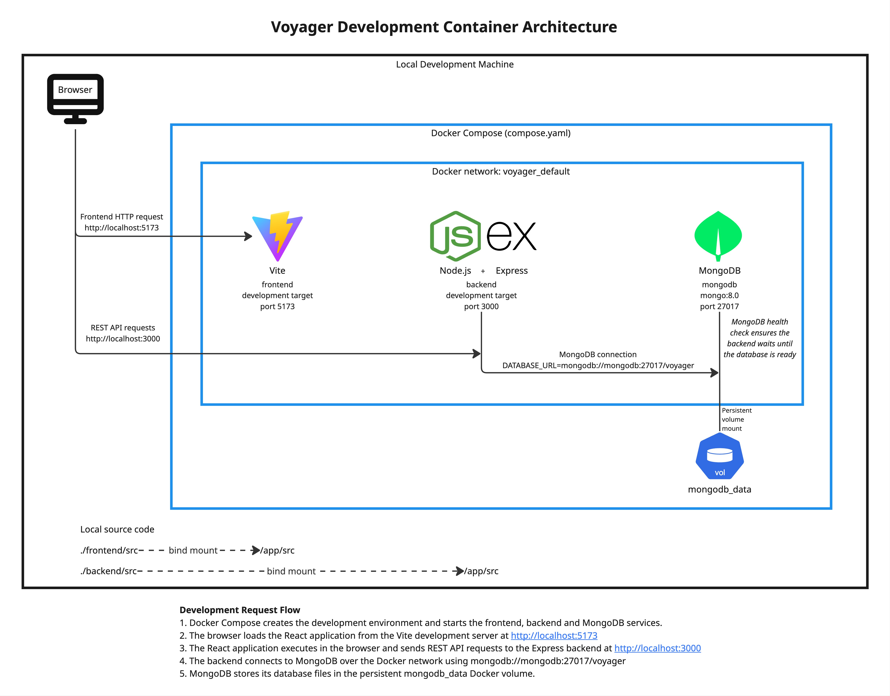
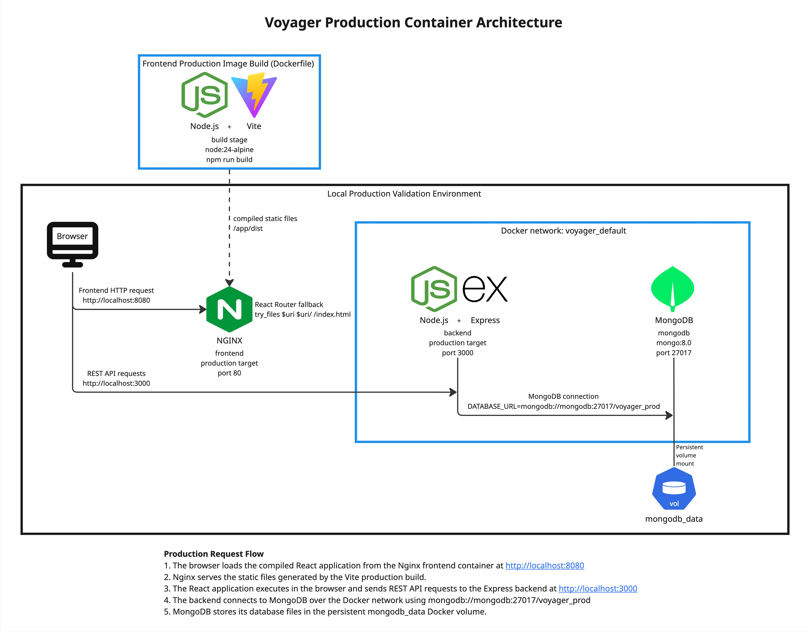
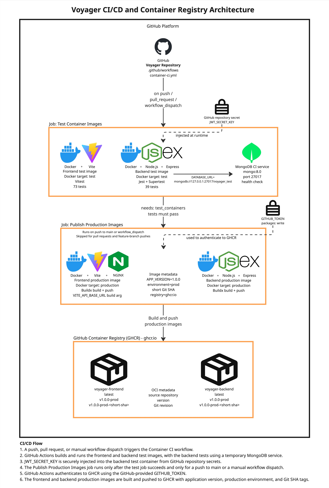

# Voyager Containerisation Architecture

Voyager is a MERN travel planning application with a React frontend, Node.js and Express backend, and MongoDB database. The application has been containerised with Docker for development, testing, and production.

Docker Compose manages the local development environment, while GitHub Actions builds and tests the container images and publishes successful production images to the GitHub Container Registry (GHCR). Separate Dockerfile targets are used for development, testing, and production so each environment includes only the tools and dependencies it requires.

The following diagrams show the three main parts of the containerisation architecture:

- The local development environment.
- The production container build and validation environment.
- The CI/CD and container registry workflow.

## Development Architecture

The local development environment is defined in the root `compose.yaml` file. Docker Compose starts three services: a Vite frontend development container, a Node.js and Express backend development container, and a MongoDB 8.0 database container.

The frontend is available at `http://localhost:5173`, while the backend REST API is available at `http://localhost:3000`. Although the frontend is served from its Docker container, the React application itself executes in the browser. This means the browser first loads the application from the Vite development server and then sends API requests directly to the backend through port `3000`.

The backend and MongoDB communicate through the Docker network created for the Compose project. Docker Compose creates the default network as `voyager_default`, and containers attached to this network can resolve each other using their service names. The backend therefore connects to MongoDB using `mongodb://mongodb:27017/voyager`, where `mongodb` is the service name defined in `compose.yaml`.

MongoDB port `27017` is not published to the host machine because the database only needs to be accessed by the backend container. Keeping the database internal to the Docker network avoids exposing a port that is unnecessary for normal application use.

### Development Bind Mounts

The frontend and backend source directories are bind-mounted into their development containers. `./frontend/src` on the local machine is mounted to `/app/src` in the frontend container, while `./backend/src` is mounted to `/app/src` in the backend container.

A bind mount makes the local source directory directly available inside the container. This allows Vite and the backend watch process to detect source-code changes as they are made, without rebuilding the Docker image after every edit.

These bind mounts are only required for development. The production images contain the application files they need directly and do not depend on source files from the developer's local machine.

### MongoDB Storage and Health Check

MongoDB stores its data in the named Docker volume `mongodb_data`. The volume exists independently of an individual MongoDB container, so local database data remains available when containers are stopped and recreated.

The MongoDB service also includes a health check. Docker Compose configures the backend to wait until MongoDB reports as healthy before starting, which prevents the backend from attempting to establish a database connection before the database is ready to accept connections.

### Development Design

The frontend, backend, and database are separated into their own containers so that each service can use its own runtime and dependencies without being tightly coupled to the developer's computer.

Docker Compose was used because Voyager requires multiple services to work together during development. It provides a simple way to start and manage the complete environment while keeping those services logically separate.

This also makes the development setup more consistent. The required Node.js and MongoDB versions are defined by the Docker configuration rather than depending entirely on the software installed directly on an individual development machine.

## Production Architecture

The production images use separate Dockerfile targets from the development environment. Development tooling such as the Vite development server, watch mode, bind-mounted source directories, and development dependencies are not required in the final production runtime.

### Frontend Production Image

The frontend Dockerfile uses a multi-stage build. Its `build` stage uses `node:24-alpine`, installs the frontend dependencies, and runs `npm run build`. Vite then compiles the React application into static production files in `/app/dist`.

The final `production` stage uses `nginx:alpine`. The compiled files from `/app/dist` are copied from the build stage into the Nginx image and served from `/usr/share/nginx/html`.

This means the final frontend production image does not need to contain the Node.js build environment, Vite, the frontend source files, or the development dependencies. The build tools are used only while creating the image, while the final runtime contains Nginx and the compiled application.

Voyager uses React Router for client-side routing, so the Nginx configuration includes the fallback `try_files $uri $uri/ /index.html;`. Without this fallback, directly loading or refreshing a route such as `/trips` would cause Nginx to look for a matching physical file and return a `404`. Falling back to `index.html` allows React Router to handle the route in the browser.

The frontend API URL is provided using the `VITE_API_BASE_URL` build argument. Vite includes this value in the compiled frontend during the build, so it is build-time configuration rather than a runtime secret.

### Backend Production Image

The backend production target also uses `node:24-alpine`, but unlike the development target it installs production dependencies only with `npm ci --omit=dev`.

Only the application source required for production is copied into the final image, and the application is started with `npm start`. The backend process also runs as the non-root `node` user rather than using the container's root account.

This keeps the production image focused on the files and dependencies required to run the application and reduces the privileges available to the application process.

### Production Validation

The frontend and backend production images were built and run locally with MongoDB before the CI/CD workflow was completed.

For local validation, the Nginx frontend container was available at `http://localhost:8080`, while the backend remained available at `http://localhost:3000`. The backend production container was attached to the `voyager_default` Docker network and connected to MongoDB using `mongodb://mongodb:27017/voyager_prod`.

The Nginx frontend container did not require access to this Docker network because it does not make API requests directly to the backend. Nginx serves the compiled React application to the browser, and the React application then sends REST API requests from the browser to the backend.

The production environment was manually tested using registration, login, trip management, itinerary item management, PDF export, and direct React Router route refreshes. This confirmed that the production Docker targets worked correctly and that the Nginx fallback handled client-side routes as expected.

## CI/CD and Container Registry Architecture

Voyager uses GitHub Actions for automated container testing and production image publishing. The workflow is defined in [.github/workflows/container-ci.yml](../.github/workflows/container-ci.yml) and runs for pushes, pull requests, and manual `workflow_dispatch` events.

The workflow is divided into two jobs: `Test Container Images` and `Publish Production Images`. The publishing job depends on the successful completion of the test job so that production images cannot be published from a failing build.

### Container Testing

The first workflow job builds and runs the frontend and backend Docker `test` targets.

The frontend test image runs the Vitest suite, which currently contains 73 tests. The backend test image runs the Jest and Supertest suite, which currently contains 39 tests.

GitHub Actions also starts a temporary MongoDB 8.0 service for the backend integration tests. The backend test container connects to this service using `mongodb://127.0.0.1:27017/voyager_test`.

Running the tests from Docker images verifies more than the application code alone. It also confirms that the test targets defined in the Dockerfiles contain the dependencies and configuration required to execute the test suites successfully in a container environment.

### Secrets and Authentication

The backend tests require `JWT_SECRET_KEY`. This value is stored as a GitHub repository secret rather than being committed to the repository, written into the workflow file, or included in a Docker image.

When the backend tests run, GitHub Actions exposes the secret only to the relevant step and passes it into the test container at runtime. This allows the application to receive the configuration it needs without permanently storing the value in source control or an image layer.

Production image publishing uses the GitHub-provided `GITHUB_TOKEN` with `packages: write` permission to authenticate to GHCR. Using the automatically generated token avoids maintaining a separate long-lived registry password or personal access token.

`JWT_SECRET_KEY` and `GITHUB_TOKEN` therefore serve different purposes: the JWT secret is application configuration required by the backend tests, while `GITHUB_TOKEN` authenticates the workflow to the container registry.

### Production Image Publishing

The publishing job declares `needs: test_containers`, so it does not begin unless the complete container test job has succeeded.

Publishing is also restricted to pushes to `main` and manually triggered `workflow_dispatch` runs. Pull requests and pushes to feature branches still execute the container tests, but they do not update the published production images. This prevents unmerged feature-branch changes from replacing the current production packages.

After successful tests, Docker Buildx builds the `production` target from both Dockerfiles and pushes the resulting images to GHCR.

The published packages are:

- `ghcr.io/ameliafff/voyager-frontend`
- `ghcr.io/ameliafff/voyager-backend`

The frontend build also receives the `VITE_API_BASE_URL` build argument required by the Vite production build.

### Image Tags and Metadata

Each production image is published with three tags: `latest`, `v1.0.0-prod`, and `v1.0.0-prod-<short-sha>`.

The `latest` tag provides a simple reference to the most recently published production image. The `v1.0.0-prod` tag identifies the application version and production environment, while the short-SHA tag additionally identifies the exact Git revision used to create the image.

For example, a production image created from commit `833f4e7` is tagged as `v1.0.0-prod-833f4e7`.

Together, the image names and tags identify the container registry, application component, application version, deployment environment, and source revision. This provides both convenient tags for normal use and a revision-specific tag for traceability.

The published images also include OCI metadata for the source repository, application version, and complete Git revision. These labels provide another link between a container artifact and the source used to create it.

## Docker Ignore Files

The frontend and backend each include a dedicated `.dockerignore` file to control which files are included in the Docker build context.

Files and directories that are not required by the build are excluded, including `node_modules/`, `coverage/`, local `.env` files, logs, Git metadata, documentation, and operating-system files such as `.DS_Store` and `Thumbs.db`. The frontend also excludes its generated `dist/` directory.

`.env.example` is explicitly retained because it contains example configuration rather than real secret values.

Excluding unnecessary files reduces the amount of data sent to Docker during a build and helps prevent local dependencies, generated output, repository metadata, and environment files from being copied into container images.

The Dockerfiles also copy `package.json` and `package-lock.json` before copying the application source, then run `npm ci`. This allows Docker to reuse the dependency layer when source files change but the package manifests remain unchanged, improving build caching.

## Security

The containerisation setup avoids storing real secrets in Dockerfiles or container images. Local `.env` files are excluded from both Git and Docker build contexts, while GitHub Actions uses repository secrets for the JWT value required during backend testing.

MongoDB is not exposed through a host port in the Docker Compose development environment because only the backend service needs to communicate with it. The backend production container also runs as the non-root `node` user.

Production publishing is restricted to successful test runs under the configured workflow conditions, which prevents failed builds and ordinary feature-branch pushes from updating the production packages.

`VITE_API_BASE_URL` is treated as configuration rather than a secret because Vite includes frontend environment values in the JavaScript delivered to the browser. Any value provided through a `VITE_` variable should therefore be considered visible to the client.

## Validation

The containerised development environment was successfully built and run using Docker Compose. The full application was manually tested through the frontend, including registration, authentication, trip management, itinerary item management, and PDF export.

The frontend Docker test image passes all 73 frontend tests, while the backend Docker test image passes all 39 backend tests against MongoDB.

The production frontend and backend images were also built and tested locally, including direct route refreshes through Nginx to verify the React Router fallback.

GitHub Actions then independently rebuilt the container test images and successfully published both production images to GHCR following a merge to `main`. The resulting packages contained the expected `latest`, version/environment, and short Git SHA tags.

## Summary

Voyager uses separate Docker targets for development, testing, and production so that each environment contains the tools and dependencies appropriate to its purpose.

Docker Compose provides a repeatable local multi-container development environment, while the production targets remove development-only tooling and dependencies from the final runtime images.

GitHub Actions provides automated container testing and controlled production publishing to GHCR, with secrets supplied at runtime and published images linked back to their application version and Git source revision.

Together, these components provide a container architecture that keeps the frontend, backend, and database responsibilities separate while improving consistency between environments, reducing unnecessary production content, protecting sensitive configuration, and providing traceability for published images.
